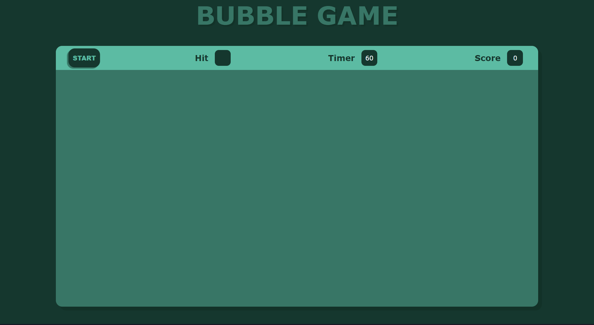
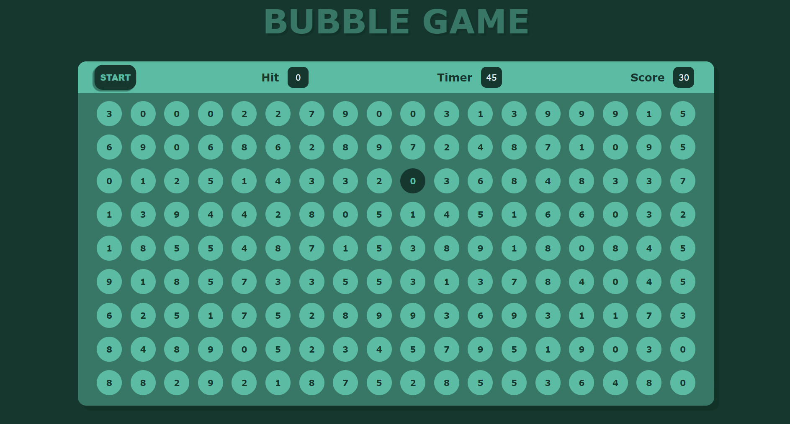
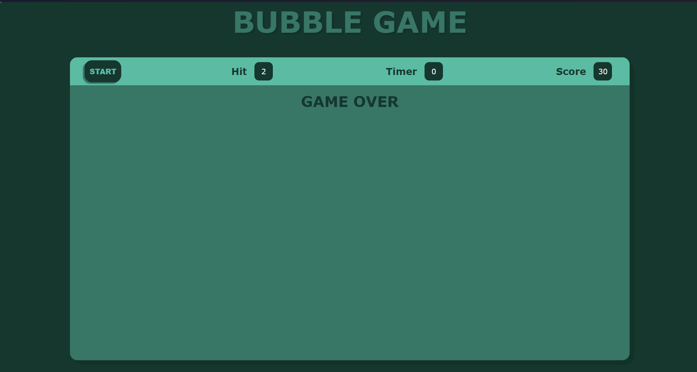

# Bubble Hit Game

A simple game where you need to find the same bubble as given in "Hit" within a time interval of 60 seconds. Each correct click earns you a score of 10 points.

## Live Game

You can play the live game [here](https://aroult-govinda.github.io/Bubble-Game/).

## How to Play

1. Click the "Start" button to begin the game.
2. A random number will appear in the "Hit" section.
3. Click on the bubble containing the same number as the "Hit" number.
4. Each correct click will earn you 10 points.
5. The game runs for 60 seconds. Try to score as many points as possible within this time.

## Screenshots

*Description: Screenshot showing the game at the start.*

*Description: Screenshot showing the game in progress.*

*Description: Screenshot showing the game over screen.*

## Code Overview

### HTML
The HTML file includes the structure of the game, with a button to start the game, sections to display the timer, hit number, score, and the bubbles.

### CSS
The CSS file contains styles for the bubbles and game layout.

### JavaScript
The JavaScript file handles the game logic, including:
- Generating random bubbles
- Starting and managing the timer
- Updating the score
- Handling user interactions

## License

This project is licensed under the MIT License.

